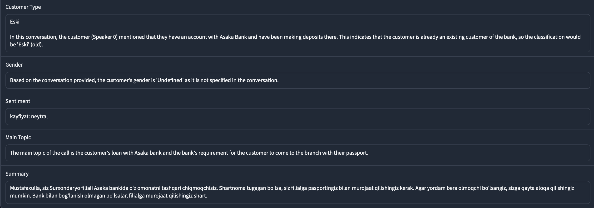

# Aisha-Chatbot

## Model testing
Ushbu Loyhaning asosiy maqsadi foydalanuvchi bilan tabiiy muloqot qila oluvchi chat botni aynan bir malumotlar uchun javob berishga o'rgatish. Chat-botni yaratish davomida bir nechta **Model**larni va **API-Provider**larni sinab ko'rdik.

### API-Providerlar
API providerlari orasi 4 ta eng optimallarini sinab ko'rdik:
1. Groq AI
2. Open AI
3. Together AI
4. Novita AI
Yuqorda keltirilgan providerlarning bir biridan asosiy farqi bu ishlatilinayotgan modellarning narxlarni, shuning bir nechtasida boshqalarda bo'lmagan modellar ham bor.

### Modellar
Ayni vaqtda modellar juda ko'pligi sababli modellarning mashhurlari va ishonlilariga katta etibor qaratildi. Albatta boshqalari ham sinovdan o'tkazildi ammo kutilgan natijani bermadi. Modellarni test qilish davomida asosan ikkita muammoga duch kelindi: 
1. Modellar O'zbek tili bilan ishlay olishmaydi.
2. Modellar malumotlarni chiqarishda yoki tushunarsiz malumot berishadi.
Ishonchi katta modellarda ham bu muammolar bor. Ammo, boshqalariga qaraganda yaxshiroq javob qaytarishadi. Ishonchli modellar so'rovlarga javob berishda bir birga nisbata kichik ustunlik va kamchiliklari mavjud.

*** Transcribed text ***

*** llama3-groq-8b-8192-tool-use-preview ***
Modelni o'zbek tilida ham, shuningdek xulosalashda ham kichik mummolari bor. Asosiy muamolar 'Main Topic' va 'Summary' qismlarda yuzaga chiqdi.

*** gemma2-9b ***
Model juda yaxshi va muammosiz ishladi, faqat jinsni aniqlashda muammolarga duch kelayapti.

*** llama-3.2-11b ***
Model juda yaxshi va muammosiz ishladi.

*** mixtral-8x7b ***
Model juda yomon ishladi. Ikki turdagi xato ham juda katta tasirda chiqdi

*** Qwen2.5-72B ***
Model ortiqcha malumotlar qo'shmoqda, Lekin ishlayapti.

*** Nous-Hermes-2-Mixtral-8x7B ***
'Summary' qismi juda katta xatolik bor.

*** Gemini ***
Gemini ishlatishda google bilan muammolar bo'ldi.

*** OpenAI ***
_Waiting for Api-key_

### Diarization uchun UzbekVoice ishlatildi

# Qo'llanma
Asosiy run qilinadigan fayllar bu **main.py** va  **new.py**. Farqi **main.py** audio qabul qilib, uni tekstga o'girib, keyin analiz qiladi. **new.py** esa tekst qabul qiladi va uni analiz qiladi.
*punctuation.py* va *uzbekvoice.py* **main.py** uchun ichki qo'shimcha funksiyalar beradi.

*audio.mp3* va *translation.txt* asosiy ikki fayllarni test qilish uchundir.

**requirements.txt** orqali mashxiy muhitda ishlatilinishi mumkin.
Tafsiya etiladigan python versiyasi: 3.9 => 3.12
